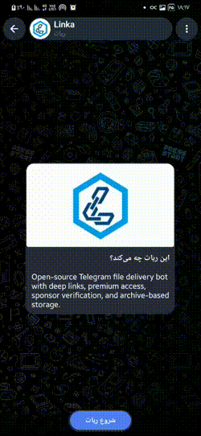
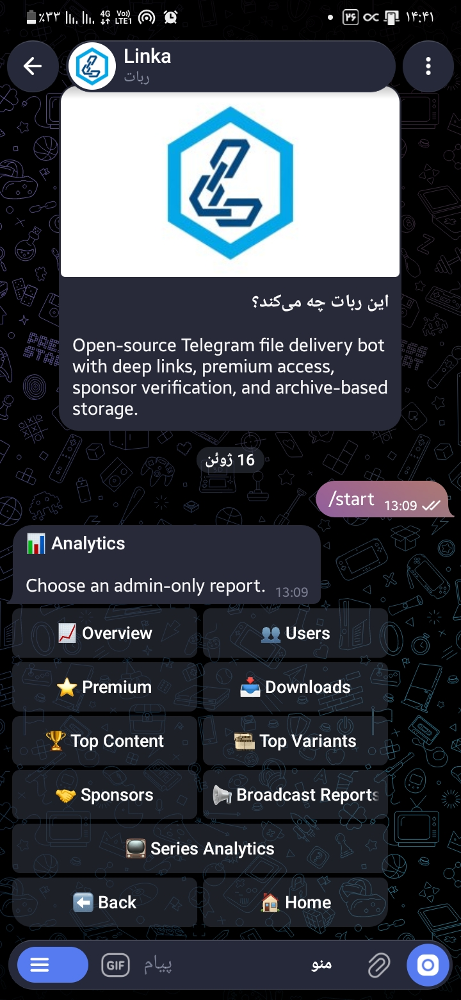
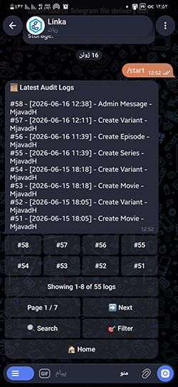
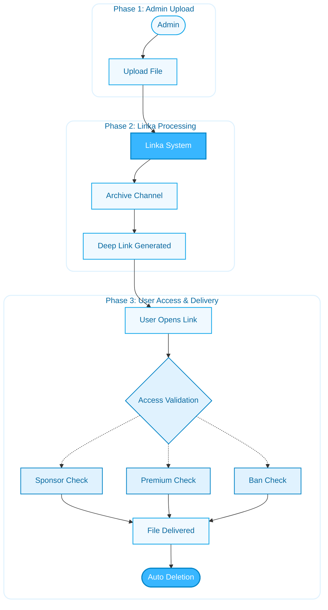

<p align="center"></p>

# Linka

> Open-source Telegram file delivery platform powered by deep links, premium access, sponsor verification, and archive-based storage.

Linka helps you build a complete Telegram file delivery system in minutes.

Upload files through the admin panel, generate deep links, enforce sponsor subscriptions, offer premium access, and automatically deliver files to users — all without storing file bytes outside Telegram.

---

## Why Linka?

Managing file distribution in Telegram can quickly become messy:

* Manual file forwarding
* Expired links
* Sponsor verification
* Premium content access
* Download tracking
* User management

Linka solves these problems with a single self-hosted bot.

---

## Features

### File Delivery

* Deep-link based file delivery
* Telegram-native file storage using `file_id`
* Automatic file deletion after delivery
* Download tracking and analytics
* Archive channel storage

### Content Management

* Movies
* Series
* Episodes
* Multiple quality variants
* Free and premium variants
* Deep-link generation per variant

### Sponsor System

* Multiple sponsor channels
* Required membership verification
* Automatic sponsor expiration
* Date-based campaigns
* Target-member campaigns
* Membership re-checking

### Premium System

* Premium subscription plans
* Premium-only content
* Premium-only quality variants
* Manual subscription management
* Subscription expiration handling

### User Management

* Search users
* Ban and unban users
* Grant and remove premium access
* Direct admin messaging
* User statistics

### Broadcasts

* Send messages to:

  * All users
  * Premium users
  * Free users
* Progress tracking
* Rate limiting
* Cancellation support
* Delivery statistics

### Analytics

* User analytics
* Download analytics
* Sponsor analytics
* Premium analytics
* Top content reports
* Top variant reports

### Administration

* Audit logs
* Health monitoring
* Maintenance tools
* Multi-admin support
* Background job management

---

## Screenshots

### Movie Creation Flow



### Analytics

<a href="docs/images/Analytics.jpg">
  
</a>

### Audit Logs

<a href="docs/images/Audit_Logs.jpg">
  
</a>

---

## How It Works


---

## Quick Start

### Requirements

* Docker
* Docker Compose
* Telegram Bot Token
* PostgreSQL

### Clone Repository

```bash
git clone https://github.com/your-org/linka.git
cd linka
```

### Configure Environment

```bash
cp .env.example .env
```

Edit:

```env
BOT_TOKEN=
BOT_USERNAME=
ARCHIVE_CHAT_ID=
ADMIN_TELEGRAM_IDS=
DATABASE_URL=
```

### Start

```bash
docker compose up --build
```

Run migrations:

```bash
docker compose run --rm bot alembic upgrade head
```

The bot is now ready to use.

---

## Configuration

All configuration is environment-based.

Important settings:

```env
BOT_TOKEN=
BOT_USERNAME=

DATABASE_URL=

ARCHIVE_CHAT_ID=

ADMIN_TELEGRAM_IDS=

FILE_DELETE_AFTER_SECONDS=

SPONSOR_VERIFICATION_INTERVAL_SECONDS=

BROADCAST_RATE_LIMIT_PER_SECOND=
```

See `.env.example` for the full list.

---

## Tech Stack

* Python 3.12+
* Aiogram 3
* PostgreSQL
* SQLAlchemy 2.x
* Alembic
* APScheduler
* Docker
* Docker Compose

---

## Project Structure

```text
src/
├── admin/
├── bot/
├── core/
├── database/
├── handlers/
├── keyboards/
├── middlewares/
├── migrations/
├── models/
├── repositories/
├── scheduler/
├── services/
└── tests/
```

---

## Security

* Never commit `.env`
* Keep your bot token private
* Use private archive channels
* Re-check sponsor membership before delivery
* Use least-privilege database credentials

---

## License

MIT License

See the LICENSE file for details.
